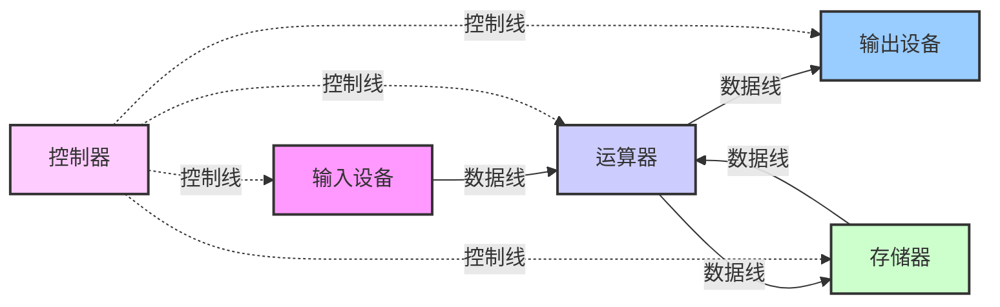
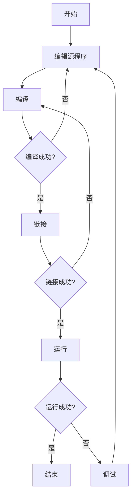

# C++ 第一课
## 课程学习建议
### 教学用书推荐
- 《C语言程序设计》，谭浩强，清华大学出版社
- 《The C++ Programming Language》C++之父编写
- 《A Tour of C++》
- **《高级语言C++程序设计》**，刘璟、周玉龙编著，高等教育出版社
- 《C++ Primer》
- **《thinking in C++》** C++编程思想
### 寒假学习建议
  - 进阶：C++ Primer中文第五版
  - 自学图形化编程，编写一个小图形化程序：QT MFC
### 暑假学习建议
- 做练习，自己尝试做一个大型C++项目
- 开始编程训练
    - 参加ACM协会的培训
    - 在acm.nankai.edu.cn上刷题
    - http://leetcode.com/，找工作笔试用
    - heetp://www.hackerrank.com，进阶刷题，偏重算法
    - 竞赛：ACM/ICPC TopCoder 百度之星 Google Code Jam
## 计算机与程序设计
### 计算机体系结构
- 冯·诺依曼结构

### 计算机的组成
- 存储器（RAM - Random Access Memory）
  存储程序指令和数据，包括**随机存取存储器**和**只读存储器**（Read Only Memory）
- 中央处理器（CPU - Central Processing Unit）
  又可细分为**控制器**（CU）和**运算器**（ALU）
- 输入输出设备（I/O - Input/Output）
  也称外部设备，负责对数据和程序进行输入与输出

### 二进制
- 每个bit只有0和1
- 逢2进1
- 计算机内部使用二进制

### 存储器单元
- 字节（Byte）
  - 8 bit = 1 byte
  - 1个字节可以表示0（00000000）到255（11111111）
  - 字节是计算机中指令和数据的基本存储单元
- 存储器单元
  - 按字节安排
- 存储地址
  - 顺序号，为每个存储器单元指定一个序号

### 反码与补码
- 源码
  - 一个整数，按照绝对值大小转换成的二进制数
- 反码
  - 将二进制数按位取反，所得的新二进制数称为原二进制数的反码
- 补码
  - 反码加1称为补码
  - 计算机内存中，负数以二进制补码形式表示和存放
    - 将减法运算变为加法运算
    - 0有了统一表示（+0和-0）

### 程序设计语言
- 机器语言
  -用二进制代码表示指令
- 汇编语言（Assemble Language）
- 高级语言

### 面向对象型机构（Object Oriented）
- 如何调试C语言程序

### 程序设计语言的工作原理
- C/C++采用编译运行的方式（最经典、效率最高）
  -编辑、编译、链接、运行
- 还有另一种程序运行方式：**解释运行**
  - 速度慢，但简单
  - 解释器：按程序指令一步步工作，完成程序功能
  - BASIC、JavaScript、PHP、ASP等
